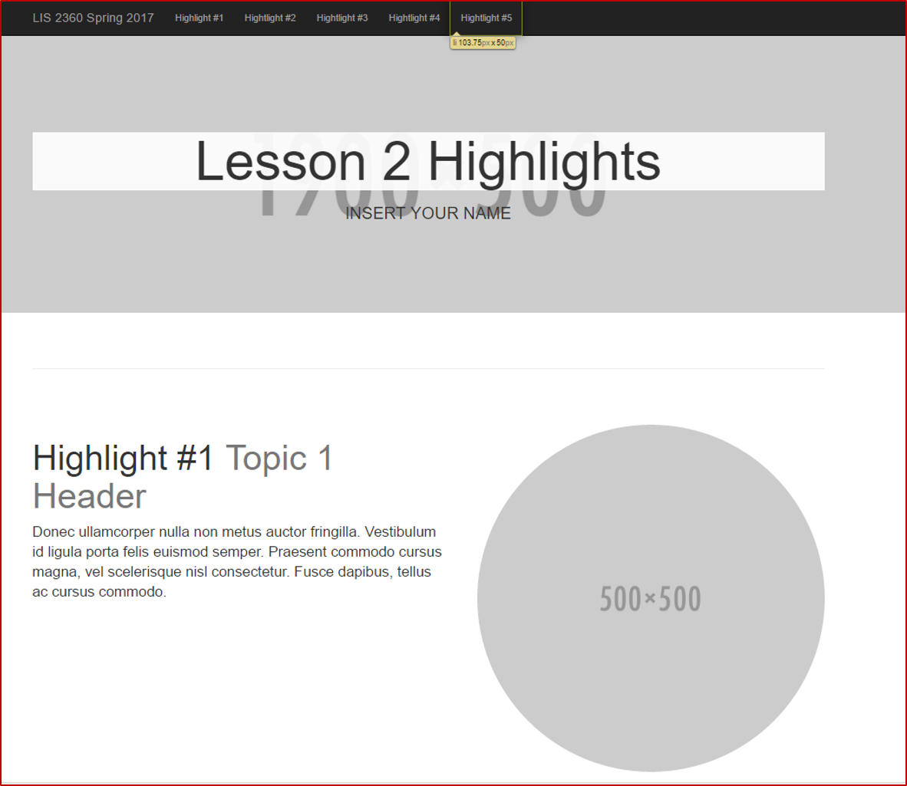

# Project Name:  Lesson 3 Version Control

## Course Title:
LIS 2360:  Web Application Development

## Assignment Date:  
(Month Day, Year)

## Student Name:  
(First and Last Name)

## Project Description:
(In your own words, briefly describe the assignment.)

## Lessons Learned in the Assignment:
1. (Briefly describe a lesson/concept learned in this lesson.)
2. (Briefly describe a lesson/concept learned in this lesson.)
3. (Briefly describe a lesson/concept learned in this lesson.)

## Screenshot of Final Lesson 3 Assignment:

